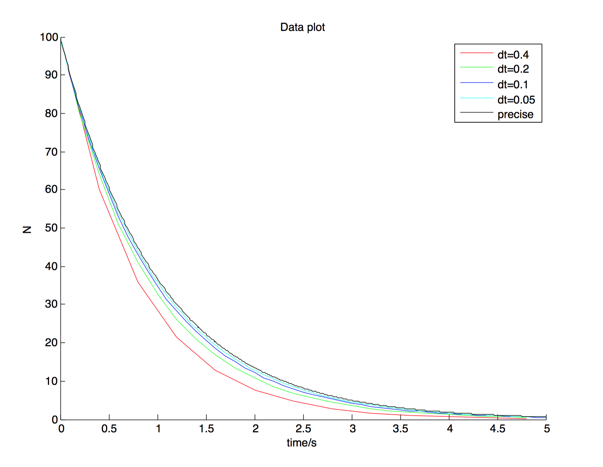
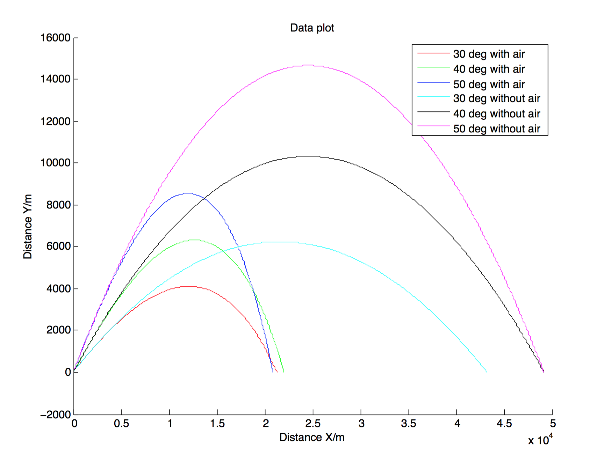
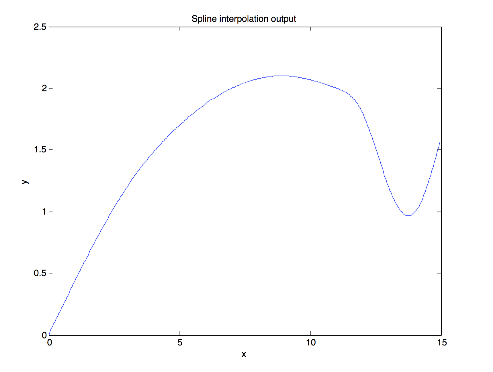

[mathjax]

# 问题一
### 问题描述
将时间序列分成等间距的$t_0, t_1, t_2, ..., t_n$，时间间隔$\delta t$，于是根据微分方程
$$\frac{dN(t)}{dt}=-\frac{N(t)}{\tau}$$
可以写出迭代公式：
$$N_{i+1} = -\frac{N_{i}(t)}{\tau}\cdot dt + N_i$$
而精确解，可以直接积分，得到：
$$N(t) = N(0)e^{-\frac{t}{\tau}}$$
### 问题求解
根据迭代公式可以直接写出求解的函数solve_fdm()，它会进行有限差分迭代，然后将结果输出到文件中，供MATLAB绘制最终的图形。而主程序控制4个迭代的进行，并为solve_fdm()打开相关的文件。代码如下：
<pre class="wrap:true lang:default decode:true">//
//  fdm_radiation.cpp
//  computational physics
//
//  Created by Haoyan Huo on 5/2/15.
//  Copyright (c) 2015 Haoyan Huo. All rights reserved.
//

#include <iostream>
#include <fstream>

void solve_fdm(double dt, std::ofstream & fout){
    // dN / dt = - N
    double N = 100.0;
    
    for (double t=0.0; t<=5.0; t+= dt) {
        fout<<t<<' '<<N<<std::endl;
        N -= dt * N;
    }
}

// this function solves the problem by using FDM
int main(int, char**){
    double dts[] = {0.4, 0.2, 0.1, 0.05};
    
    for (int i = 0; i<sizeof(dts)/sizeof(dts[0]); ++i) {
        char buf[100];
        sprintf(buf, "/Users/huohaoyan/Desktop/output%d.txt", i);
        std::ofstream fout(buf);
        solve_fdm(dts[i], fout);
        fout.close();
    }
    
    return 0;
}</pre>
### 结果
将不同的有限差分算出的结果和真实结果绘于同一张图中，如下：

可以看到，步长越长，则曲线越向下移动。这是因为在一步中，使用的$N_i$估计过大，造成每一步都对衰变的数量过多的估计。

# 问题二
### 解法描述
带权的插值求积公式为：
$$ \int_a^b \rho(x)f(x)dx \approx \sum_{k=0}^n A_k f(x_k) $$
问题的关键在于求出$x_k$和 $A_k$，下面首先求出高斯点$x_k$。

设$\omega(x)=\sum_{k=0}^{n+1} \omega_k x^k, \omega_{n+1}=1$是一个$n+1$次的多项式，且它满足对于任意不超过$n$次的勒让德多项式$P_j(x)$，均有：
$$\int_a^b \rho(x)\omega(x)P_j(x)dx = 0$$
则$\omega(x)$的根就是高斯点。

求出高斯点之后，用$x^i, i \le 2n+1$代替$f(x)$代入插值求积公式，得到一组关于$A_k$的线性方程组，求解它就可以得到求积公式中的求积系数。
### 求解过程
**积分1**
设$\omega(x)=x^2+A x + B$，代入正交条件，得到：
$$\begin{bmatrix}
\frac{2}{5} & \frac{2}{3} \\\\
\frac{2}{7} & \frac{2}{5}
\end{bmatrix}\begin{bmatrix}
A \\\\
B
\end{bmatrix} = \begin{bmatrix}
-\frac{2}{7} \\\\
-\frac{2}{9}
\end{bmatrix}
$$
求解这个方程组，得到：
$$\begin{bmatrix}A & B\end{bmatrix} = \begin{bmatrix}-\frac{10}{9} & \frac{5}{21} \end{bmatrix}$$
求解$x^2-\frac{10}{9}x+\frac{5}{21}=0$，得到：
$$x_0 = \frac{35-2\sqrt{70}}{63} \\\\
x_1 = \frac{35+2\sqrt{70}}{63}$$
选择0次和1次的$f(x)$代入高斯积分公式：
$$
\int_0^1 \sqrt{x}dx=A_0 +A_1 \\\\
\int_0^1 \sqrt{x}xdx = A_0 x_0 + A_1 x_1
$$
得到：
$$
A_0 = \frac{50-\sqrt{70}}{150} \\\\
A_1 = \frac{50+\sqrt{70}}{150}
$$
于是：
$$
\int_0^1 \sqrt{x} f(x)dx=\frac{50-\sqrt{70}}{150} f(\frac{35-2\sqrt{70}}{63}) + \\\\ \frac{50+\sqrt{70}}{150} f(\frac{35+2\sqrt{70}}{63})
$$
$f(x)$不超过3次。
**积分2**
设$\omega(x)=x^2+A x + B$，由正交条件：
$$\begin{bmatrix}
0 & \frac{8}{3} \\\\
\frac{16}{15} & 0
\end{bmatrix}\begin{bmatrix}
A \\\\
B
\end{bmatrix} = \begin{bmatrix}
-\frac{16}{15} \\\\
0
\end{bmatrix}
$$
$$\begin{bmatrix}A & B\end{bmatrix} = \begin{bmatrix}0 & -\frac{2}{5} \end{bmatrix}$$
求解$x^2-\frac{2}{5}=0$，得到：
$$x_0 = -\sqrt{\frac{2}{5}} \\\\
x_1 = \sqrt{\frac{2}{5}}$$
代入高斯积分公式：
$$
\int_{-1}^1 (1+x^2)dx=A_0 +A_1 \\\\
\int_{-1}^1 (1+x^2)xdx = A_0 x_0 + A_1 x_1
$$
得到：
$$
A_1 = A_0 = \frac{4}{3}
$$
于是：
$$
\int_{-1}^1 (1+x^2) f(x)dx=\frac{4}{3} f(-\sqrt{\frac{2}{5}}) + \frac{4}{3} f(\sqrt{\frac{2}{5}})
$$
$f(x)$不超过3次。

**积分3**
设$\omega(x)=x^3+A x^2 + B x+C$，由正交条件：
$$\begin{bmatrix}
\frac{2}{7} & \frac{2}{5} & \frac{2}{3} \\\\
\frac{2}{9} & \frac{2}{7} & \frac{2}{5} \\\\
\frac{10}{77} & \frac{2}{15} & \frac{2}{21}
\end{bmatrix}\begin{bmatrix}
A \\\\
B \\\\
C
\end{bmatrix} = \begin{bmatrix}
-\frac{2}{9} \\\\
-\frac{2}{11} \\\\
-\frac{14}{117}
\end{bmatrix}
$$
$$\begin{bmatrix}A & B & C\end{bmatrix} = \begin{bmatrix}-\frac{21}{13} & \frac{105}{143} & -\frac{35}{429}\end{bmatrix}$$
求解$x^3-\frac{21}{13}x^2+\frac{105}{143}x-\frac{35}{429}=0$，得到：
$$x_0 = 0.90080583 \\\\
x_1 = 0.54986850 \\\\
x_2 = 0.16471029
$$
代入高斯积分公式：
$$
\int_0^1 \sqrt{x}dx=A_0 +A_1 + A_2 \\\\
\int_0^1 \sqrt{x}xdx = A_0 x_0 + A_1 x_1 + A_2 x_2 \\\\
\int_0^1 \sqrt{x}x^2dx = A_0 x_0^2 + A_1 x_1^2 + A_2 x_2^2
$$
得到：
$$
A_0 = 0.233282\\\\
A_1 = 0.307602 \\\\
A_2 = 0.125783
$$
于是：
$$
\int_0^1 \sqrt{x} f(x)dx= A_0 f(x_0) + A_1 f(x_1) + A_2 f(x_2)
$$
$f(x)$不超过5次。

# 问题三
### 运动方程
问题中，炮弹的运动方程是：
$$ \frac{dx}{dt} = v_x \\\\
\frac{dy}{dt} = v_y \\\\
\frac{d v_x}{dt} = -\frac{B_2 v^2}{M} cos\theta\\\\
\frac{d v_y}{dt} = -\frac{B_2 v^2}{M} sin\theta - g $$
其中，$tan\theta = \frac{v_y}{v_x}$。
### 求解程序
使用有限差分方法，将时间序列分成等间距的$t_0, t_1, t_2, ..., t_n$，时间间隔$\delta t$，在不同时间点上定义$x_i, y_i, v_{xi}, v_{yi}$，于是可以写出迭代公式：
$$ x_{i+1} = v_{xi} \cdot \delta t + x_i\\\\
y_{i+1} = v_{yi} \cdot \delta t +y_i \\\\
v_{xi+1} = -\frac{B_2}{M} v_{xi} \sqrt{v_{xi}^2+v_{yi}^2} \cdot \delta t +v_{xi}\\\\
v_{yi+1} = (-\frac{B_2}{M} v_{yi} \sqrt{v_{xi}^2+v_{yi}^2} - g) \cdot \delta t + v_{yi}$$
程序中，iter_func()函数进行从$t_i$到$t_{i+1}$的迭代工作，每次调用iter_func()，它会将$x, y, vx, vy$的数值更新到下一个时间点，全局变量B2_M控制空气阻力参数。solve()函数接受一个参数：炮弹的发射角，然后设置炮弹的初始位置、速度，不断调用iter_func()，直至炮弹回到地平线（$y\le 0$)，同时向数据文件不断输出炮弹的位置以供绘图。程序代码如下：
<pre class="wrap:true lang:default decode:true">//
//  problem3.cpp
//  computational physics
//
//  Created by Haoyan Huo on 5/12/15.
//  Copyright (c) 2015 Haoyan Huo. All rights reserved.
//

#include <iostream>
#include <fstream>
#include <cmath>

const double G = 9.81;
const double DT = 0.01;
double B2_M = 4e-5;

void iter_func(double& x, double& y, double& vx, double& vy){
    x += vx * DT;
    y += vy * DT;
    
    double dvxi, dvyi, sqrted = sqrt(vx*vx+vy*vy);
    dvxi = - B2_M * vx * sqrted * DT;
    dvyi = (- B2_M * vy * sqrted - G) * DT;
    vx += dvxi;
    vy += dvyi;
}

void solve(double theta, std::ofstream& fout){
    double v0 = 700.0;
    double x, y, vx, vy, t;
    
    // initial condition
    x = 0;
    y = 0;
    vx = v0 * cos(theta);
    vy = v0 * sin(theta);
    t = 0;
    
    int steps = 0;
    std::cout<<"begin solving problem"<<std::endl;
    while (y >= 0.0) {
        fout<<t<<' '<<x<<' '<<y<<std::endl;
        iter_func(x, y, vx, vy);
        t += DT;
        steps += 1;
    }
    fout<<t<<' '<<x<<' '<<y<<std::endl;
    
    std::cout<<"problem solved after "<<steps<<" steps"<<std::endl;
    std::cout<<"t: "<<t<<" s"<<std::endl
        <<"xf: "<<x<<" m"<<std::endl
        <<"v: "<<sqrt(vx*vx+vy*vy)<<" m/s"<<std::endl
        <<"vx: "<<vx<<" m/s"<<std::endl<<"vy: "<<vy<<" m/s"<<std::endl<<std::endl;
}

int main(int, char**){
    std::ofstream fout1("problem3.30.txt");
    solve(30.0 / 180.0 * acos(-1), fout1);
    fout1.close();
    
    std::ofstream fout2("problem3.40.txt");
    solve(40.0 / 180.0 * acos(-1), fout2);
    fout2.close();
    
    std::ofstream fout3("problem3.50.txt");
    solve(50.0 / 180.0 * acos(-1), fout3);
    fout3.close();
    
    B2_M = 0.0;
    
    std::ofstream fout4("problem3-no-air.30.txt");
    solve(30.0 / 180.0 * acos(-1), fout4);
    fout4.close();
    
    std::ofstream fout5("problem3-no-air.40.txt");
    solve(40.0 / 180.0 * acos(-1), fout5);
    fout5.close();
    
    std::ofstream fout6("problem3-no-air.50.txt");
    solve(50.0 / 180.0 * acos(-1), fout6);
    fout6.close();
    return 0;
}</pre>
### 程序结果
**1. $\theta_1=30^{\circ}$**
有空气阻力时，落地时刻$t=57.33s$，水平位移$x_f=21274.4m$，落地时速度$v=344.82ms^{-1}$，$v_x=239.02ms^{-1}$， $v_y=-248.537 ms^{-1}$。

无空气阻力时，落地时刻$t=71.37s$，水平位移$x_f=43265.8m$，落地时速度$v=700.07ms^{-1}$，$v_x=606.218ms^{-1}$， $v_y=-350.14 ms^{-1}$。

**2. $\theta_2=40^{\circ}$**

有空气阻力时，落地时刻$t=71.2s$，水平位移$x_f=22045m$，落地时速度$v=353.658ms^{-1}$ ，$v_x=187.487ms^{-1}$，$ v_y=-299.871 ms^{-1}$。

无空气阻力时，落地时刻$t=91.75s$，水平位移$x_f=49199.2m$，落地时速度$v=700.106ms^{-1}$，$v_x=536.231ms^{-1}$， $v_y=-450.116 ms^{-1}$。

**3. $\theta_3=50^{\circ}$**

有空气阻力时，落地时刻$t=82.99s$，水平位移$x_f=20876.5m$，落地时速度$v=369.095ms^{-1}$，$ v_x=145.69ms^{-1}$，$ v_y=-339.124 ms^{-1}$。

无空气阻力时，落地时刻$t=109.34s$，水平位移$x_f=49197.7m$，落地时速度$v=700.125ms^{-1}$，$v_x=449.951ms^{-1}$， $v_y=-536.394 ms^{-1}$。

**4. 图像**

# 问题四
### 共轭梯度法
共轭梯度法的详细内容已在课上讲过，这里仅仅列出求解需要的方程式：
要求解方程
$$\mathbf{Ax=b}$$
定义二次函数
$$\phi(\mathbf{x}) = \frac{1}{2}\mathbf{x^T A x - b^T x}$$
则二次函数$\phi(\mathbf{x})$的极值点，就是线性方程的解。
给定初始点 $ \mathbf{x_0} $ ，沿着方向$\mathbf{p_i}$搜索下一个点，搜索步长为$\alpha_i$，即为：
$$\mathbf{x_1}=\mathbf{x_0} + \alpha_0 \mathbf{p_0} \\\\
\mathbf{x_2}=\mathbf{x_1} + \alpha_1 \mathbf{p_1} \\\\
\dots \\\\$$
共轭梯度法告诉我们，较优秀的搜索算法应该满足：
$$ \alpha_{i} = \frac{\mathbf{r^T_i p_i}}{\mathbf{r^T_i A p_i}} $$
第一步搜索，$i=0$
$$ \mathbf{r_0} = \mathbf{b} - \mathbf{Ax_0} \\\\
\mathbf{p_0}=\mathbf{r_0}$$
之后的搜索中，$i\ge 1$
$$ \mathbf{r_{i+1}} = \mathbf{r_i} - \alpha_i \mathbf{Ap_i} \\\\
\beta_{i+1} = - \frac{\mathbf{r^T_{i+1} Ap_i}}{\mathbf{p^T_i} \mathbf{Ap_i}} \\\\
\mathbf{p_{i+1}} = \mathbf{r_{i+1}} + \beta_{i+1} \mathbf{p_i}$$
当迭代之间的解变化在精度范围之内时，就可以认为解收敛了。
### 程序实现
solve()函数实现了共轭梯度法求解线性方程组。它的五个参数分别为：解向量的$\mathbf{x}$数组，右端向量$\mathbf{b}$数组，方程组个数N，迭代精度$\epsilon $，是否初始化解向量（置零）。

为了达到最高效，程序中使用函数实现了向量、矩阵之间的运算，并利用$\mathbf{A}$的稀疏性，将矩阵乘法最大程度上进行了优化。但这样做牺牲了代码的可读性，因此这个程序只能用来求解这个题目，若要一般化还需做很多改动。

程序使用无穷范数作为停止迭代的标准，即寻找迭代解中变化最大的元素，考察它是否超过$\epsilon$。控制主函数中的N即可控制矩阵的阶数（或方程个数）。代码如下：
<pre class="wrap:true lang:default decode:true">//
//  conjugate_gradient.cpp
//  computational physics
//
//  Created by Haoyan Huo on 5/1/15.
//  Copyright (c) 2015 Haoyan Huo. All rights reserved.
//

// codes here are fully optimized for solving the problem,
// however code convention is compromised.
// still a lot of stuff must be done to it...

#include <cstdio>
#include <cstring>
#include <cmath>

const bool IN_DEBUG = false;

void vector_times_A(double* v, double* ret, unsigned N){
    static double* result = NULL;
    if(result == NULL){
        // FIXME: here we leak N doubles, but it should be okay.
        result = new double[N];
    }
    
    for(int i = 0;i<N;++i){
        result[i] = v[i] * 3.0;
        if(i-1>=0)
            result[i] += v[i-1] * -1.0;
        if(i+1<=N-1)
            result[i] += v[i+1] * -1.0;
        if(N-1-i != i && N-1-i != i-1 && N-1-i != i+1)
            result[i] += v[N-1-i] * 0.5;
    }
    
    memcpy(ret, result, sizeof(double) * N);
}

void A_times_vector(double* v, double* ret, unsigned N){
    // v * A = A * v
    return vector_times_A(v, ret, N);
}

void vector_subtract(double* v1, double* v2, double* ret, unsigned N){
    for(int i = 0;i<N;++i){
        ret[i] = v1[i] - v2[i];
    }
}

double vector_abs(double* v, unsigned N){
    double result = 0.0;
    for(int i = 0;i<N;++i){
        result += v[i] * v[i];
    }
    
    return result;
}

double vector_times_vector(double* v1, double* v2, unsigned N){
    double result = 0.0;
    for(int i = 0;i<N;++i){
        result += v1[i] * v2[i];
    }
    
    return result;
}

int solve(double* x, double* b, unsigned N, double epsilon, bool init=true){
    double* r = new double[N];
    double* tmp = new double[N];
    double* r1 = new double[N];
    double* p = new double[N];
    
    int iter_step = 0;
    bool should_break = false;
    
    A_times_vector(x, tmp, N);
    vector_subtract(b, tmp, r, N);
    if(init)
        memset(x, 0, sizeof(double) * N);
    memcpy(p, r, sizeof(double) * N);
    
    if(IN_DEBUG){
        printf("step %.3d: ", iter_step);
        for(int i = 0;i<N;++i){
            printf("%.4f ", x[i]);
        }printf("\n");
    }
    
    while (!should_break) {
        double alpha = 0;
        
        // r(T) * r
        vector_times_A(p, tmp, N);
        alpha = vector_abs(r, N);
        if(alpha == 0.0)
            // ax = b
            break;
        alpha /= vector_times_vector(tmp, p, N);
        
        // update X
        should_break = true;
        for (int i = 0; i<N; ++i) {
            double update = alpha * p[i];
            if(std::abs(update) > epsilon)
                should_break = false;
            
            x[i] += update;
        }
        
        // r1 = r
        memcpy(r1, r, sizeof(double) * N);
        
        // r = r - alpha * A * p
        A_times_vector(p, tmp, N);
        for (int i = 0; i<N; ++i) {
            r[i] -= alpha * tmp[i];
        }
        
        // beta = - (r(T) * r) / (r1(T) * r1)
        double beta = - vector_abs(r, N) / vector_abs(r1, N);
        
        // p = r + beta * p
        for(int i = 0;i<N;++i){
            p[i] = r[i] + beta * p[i];
        }
        
        iter_step += 1;
        
        if(IN_DEBUG){
            printf("step %.3d: ", iter_step);
            for(int i = 0;i<N;++i){
                printf("%.4f ", x[i]);
            }printf("\n");
        }
    }
    
    delete[] r;
    delete[] tmp;
    delete[] r1;
    delete[] p;
    
    return iter_step;
}

int main(int, char**){
    unsigned N = 100;
    
    double* x = new double[N];
    double* b = new double[N];
    
    for(int i = 0;i<N;++i){
        if(i == 0 || i == N-1)
            b[i] = 2.5;
        else if(i == N/2)
            b[i] = 1.0;
        else if(i == N/2 - 1 && N % 2 == 0)
            b[i] = 1.0;
        else
            b[i] = 1.5;
    }
    
    printf("converged in %d steps\n", solve(x, b, N, 1e-6));
    printf("\nsolution in 3 digits precision:\n");
    for (int i = 0; i<N; ++i) {
        printf("%.3f ", x[i]);
    }printf("\n");
    
    return 0;
}</pre>
### 运行结果
N=100时，运行结果如下：
<pre class="wrap:true lang:default decode:true">converged in 74 steps

solution in 3 digits precision:
1.000 1.000 1.000 1.000 1.000 1.000 1.000 1.000 1.000 1.000 1.000 1.000 1.000 1.000 1.000 1.000 1.000 1.000 1.000 1.000 1.000 1.000 1.000 1.000 1.000 1.000 1.000 1.000 1.000 1.000 1.000 1.000 1.000 1.000 1.000 1.000 1.000 1.000 1.000 1.000 1.000 1.000 1.000 1.000 1.000 1.000 1.000 1.000 1.000 1.000 1.000 1.000 1.000 1.000 1.000 1.000 1.000 1.000 1.000 1.000 1.000 1.000 1.000 1.000 1.000 1.000 1.000 1.000 1.000 1.000 1.000 1.000 1.000 1.000 1.000 1.000 1.000 1.000 1.000 1.000 1.000 1.000 1.000 1.000 1.000 1.000 1.000 1.000 1.000 1.000 1.000 1.000 1.000 1.000 1.000 1.000 1.000 1.000 1.000 1.000 
</pre>
N=10000时，由于空间所限，无法将解全部写下，用省略号表示中间的数字都是1.000：
<pre class="wrap:true lang:default decode:true">converged in 742 steps

solution in 3 digits precision:
1.000 1.000 ... 1.000 1.000</pre>
# 问题五
### 求解思路
求解直接使用课件62到66式，需注意的是课件的65式是错误的，应当将第二个$b$改为$x$。
为达到空间使用最优化，程序使用67式所示的存储方法，将复杂的下标运算包装在一个类中，在外看来对矩阵的操作并没有什么变化，而在类内部使用68式判断真实访问的元素地址。
### 求解程序
程序的SBMMatrix类实现了对一个对称带状矩阵的存储，solve_sbm_linear_eq()函数求解一个对称带状矩阵方程，solve_special()实现了对一个NxN大小算例的填充、求解、打印结果。程序如下：
<pre class="wrap:true lang:default decode:true">//
//  sbm_linear_eq.cpp
//  computational physics
//
//  Created by Haoyan Huo on 5/3/15.
//  Copyright (c) 2015 Haoyan Huo. All rights reserved.
//

#include <iostream>
#include <cstring>
#include <algorithm>
#include <vector>

const bool IN_DEBUG = false;

/*
 * A n*n(2m+1) symmetric band matrix is represented by a n*(m+1)
 * array, for example, matrix:
 * 
 *      a00 ...
 *      a10 a11 ...
 *      ... ... ...
 *      am  ... ... amm
 *      ... ... ... ... ...
 *                      an-1,m  an-1n-1
 *
 * will be represented by:
 * 
 *      a00 a11 a22 a33 ... an-1n-1
 *      a10 a21 a32 ... an-1,n-2 0
 *      a21 a32 ... an-1,n-3 0 0
 *      ...
 *      am0  ...
 *
 * so, anm = 
 *          c[n-m][m] n>=m
 *          c[m-n][n] n<=m
 *          0         abs(n-m) >= M
 */

class SBMMatrix{
    double* A;
    unsigned fN, fM;
    double fZero;
    
    // the zero elements in SBM matrix share one common data pointer,
    // in case this data pointer are accessed and changed by outer
    // functions, this class checks the data and prints error message
    // if it's changed.
    void checkZeroElements(){
        if(fZero != 0.0){
            printf("ERROR: zero representation changed in SBM!");
        }
    }
public:
    ~SBMMatrix(){
        delete A;
    }
    
    SBMMatrix(double* a, unsigned N, unsigned M){
        A = new double[N*(M+1)];
        memset(A, 0, sizeof(double)*(M+1)*N);
        fZero = 0.0;
        fN = N;
        fM = M;
        memcpy(A, a, sizeof(double)*(M+1)*N);
    }
    
    SBMMatrix(unsigned N, unsigned M){
        A = new double[N*(M+1)];
        memset(A, 0, sizeof(double)*(M+1)*N);
        fZero = 0.0;
        fN = N;
        fM = M;
    }
    
    double& operator()(unsigned i, unsigned j){
        checkZeroElements();
        
        i-=1;
        j-=1;
        
        if(i>=j && i-j<=fM){
            return A[fN*(i-j)+j];
        }else if(i<=j && j-i<=fM){
            return A[fN*(j-i)+i];
        }else{
            return fZero;
        }
    }
    
    unsigned N(){
        return fN;
    }
    
    unsigned M(){
        return fM;
    }
    
    void print(){
        for (int i = 1; i<=N(); ++i) {
            for (int j = 1; j<=N(); ++j) {
                printf("%f ", operator()(i,j));
            }
            printf("\n");
        }
        printf("\n");
    }
};

void solve_sbm_linear_eq(SBMMatrix& mat, std::vector<double>& B, std::vector<double>& X){
    SBMMatrix L(mat.N(), mat.M());
    
    for (int i = 1; i<=mat.N(); ++i) {
        for (int j = std::max<int>(1, i-mat.M()); j<=i; ++j) {
            L(i,j) = mat(i,j);
            for (int k = (i<=mat.M()+1 ? 1 : i-mat.M()); k<=j-1; ++k) {
                L(i,j) -= L(i,k) * L(j,k) / L(k,k);
            }
        }
    }
    
    std::vector<double> B1;
    B1.insert(B1.begin(), mat.N(), 0);
    
    for (int i = 1; i<=mat.N(); ++i) {
        B1[i-1] = B[i-1];
        for (int j = (i<=mat.M()+1 ? 1: i-mat.M()); j<=i-1; ++j) {
            B1[i-1] -= L(i,j)*B1[j-1]/L(j,j);
        }
    }
    
    X.clear();
    X.insert(X.begin(), mat.N(), 0);
    for (int i = mat.N(); i>=1; --i) {
        X[i-1] = B1[i-1];
        for (int j=i+1; j<= (i>mat.N()-mat.M()-1 ? mat.N() : i+mat.M()); ++j) {
            // eq.65 of lecture 2 is not right...
            X[i-1] -= L(j,i) * X[j-1];
        }
        X[i-1] /= L(i,i);
    }
}

int solve_special(int N){
    double* c = new double [N * 3];
    for (int i = 0; i<N; ++i) {
        if(i == 0 || i == N-1)
            c[i] = 5.0;
        else
            c[i] = 6.0;
        
        if(i != N-1){
            c[N+i] = 4.0;
        }
        
        if(i != N-1 && i != N-2){
            c[2 * N + i] = 1.0;
        }
    }
    
    SBMMatrix mat(c, N, 2);
    
    if(IN_DEBUG){
        printf("A:\n");
        mat.print();
    }
    
    std::vector<double> B;
    for (int i = 0; i<N; ++i) {
        if(i == 0 || i == N-1)
            B.push_back(60);
        else
            B.push_back(120);
    }
    
    std::vector<double> X;
    
    solve_sbm_linear_eq(mat, B, X);
    
    if(IN_DEBUG){
        printf("\nB:\n");
        for (int i = 0; i<N; ++i) {
            printf("%f ", B[i]);
        }
    }
    
    printf("\nX:\n");
    for (int i = 0; i<N; ++i) {
        printf("%f ", X[i]);
    }
    printf("\n");
    
    return 0;
}

int main(int, char**){
    printf("Solving N=100...\n");
    solve_special(100);
    printf("\n\nSolving N=10000...\n");
    solve_special(10000);
    
    return 0;
}</pre>
### 求解结果：
N=100时，
<pre class="wrap:true lang:default decode:true">Solving N=100...

X:
-475.247525 951.089109 -1368.118812 1786.930693 -2148.118812 2512.277228 -2820.000000 3131.881188 -3388.514852 3650.495050 -3858.415842 4072.871287 -4234.455446 4403.762376 -4521.386139 4647.920792 -4723.960396 4810.099010 -4846.930693 4895.049505 -4895.049505 4907.524753 -4873.069307 4852.277228 -4785.742574 4734.059406 -4637.821782 4557.623762 -4434.059406 4327.722772 -4179.207921 4049.108911 -3878.019802 3726.534654 -3535.247525 3364.752475 -3155.643564 2968.514852 -2743.960396 2542.574257 -2304.950495 2091.683168 -1843.366337 1620.594059 -1363.960396 1134.059406 -871.485149 636.831683 -370.693069 133.663366 133.663366 -370.693069 636.831683 -871.485148 1134.059406 -1363.960396 1620.594059 -1843.366337 2091.683168 -2304.950495 2542.574257 -2743.960396 2968.514851 -3155.643564 3364.752475 -3535.247525 3726.534653 -3878.019802 4049.108911 -4179.207921 4327.722772 -4434.059406 4557.623762 -4637.821782 4734.059406 -4785.742574 4852.277228 -4873.069307 4907.524752 -4895.049505 4895.049505 -4846.930693 4810.099010 -4723.960396 4647.920792 -4521.386139 4403.762376 -4234.455446 4072.871287 -3858.415842 3650.495049 -3388.514851 3131.881188 -2820.000000 2512.277228 -2148.118812 1786.930693 -1368.118812 951.089109 -475.247525</pre>
N=10000时，
<pre class="wrap:true lang:default decode:true">Solving N=10000...

X:
-49966.201220 99932.408440 ......</pre>
输出结果太长，就不在这里完整写出了。

# 问题六
### 三次样条插值的计算公式
给定区间$[a,b]$，将区间分成$n$段，或者：
$$a=x_0 < x_1 < \dots < x_{n-1} = b$$
找到函数$S(x)$，使得它在每段区间$[x_i, x_{i+1}]$上是三次函数，则称$S(x)$是三次样条插值函数。

使用二阶导数表示三次样条插值函数，即
$$S'(x_j)=M_j, (j=0, 1, 2, \dots, n-1)$$
在整个区间上则有，
$$\frac{d^2 S(x)}{dx^2}=\frac{x_{j+1}-x}{h_j}M_j+\frac{x-x_j}{h_j}M_{j+1}, x \in [x_j, x_{j+1}], h_j = x_{j+1}-x_j \\\\
S(x) = \frac{(x_{j+1}-x)^3}{6h_j}M_j + \frac{(x-x_j)^3}{6h_j}M_{j+1}+c_{1j}x+c_{2j}, x \in [x_j, x_{j+1}]\\\\
c_{1j} = \frac{y_{j+1}-y_j}{h_j} - \frac{1}{6}h_j(M_{j+1}-M_j) \\\\
c_{2j} = \frac{y_j x_{j+1}-y_{j+1} x_j}{h_j} - \frac{1}{6}(x_{j+1} M_j-x_j M_{j+1}) \\\\
j=0, 1, 2, \dots, n-2 $$
在计算机语言中，我们有长度为$n$的数组$x$，$y$，$M$，长度为$n-1$的数组$h$，$c_1$，$c_2$。根据上面的共识，插值问题变为如何求解出数组$M$。

使用自然边界条件，即$M_0=0, M_{n-1}=0$，根据插值函数的一阶导数连续条件，有线性方程组：
$$ \begin{bmatrix}
2 & \lambda_1 \\\\
\mu_2 & 2 & \lambda_2 \\\\
& \ddots & \ddots & \ddots \\\\
& & \mu_{n-3} & 2 & \lambda_{n-3} \\\\
& & & \mu_{n-2} & 2
\end{bmatrix} \begin{bmatrix}
M_1 \\\\
M_2 \\\\
\vdots \\\\
M_{n-3} \\\\
M_{n-2}
\end{bmatrix} = \begin{bmatrix}
d_1 \\\\
d_2 \\\\
\vdots \\\\
d_{n-3} \\\\
d_{n-2}
\end{bmatrix}
$$
其中，
$$\mu_j = \frac{h_{j-1}}{h_{j-1}+h_j} \\\\
\lambda_j = \frac{h_j}{h_{j-1}+h_j} \\\\
d_j = \frac{6}{h_{j-1}+h_j}[\frac{y_j-y_{j-1}}{h_{j-1}}-\frac{y_{j+1}-y_j}{h_j}]
$$
这个方程可以方便的使用追赶法快速求解。
### 程序设计
程序的SplineInterpolate类实现了对任意长度的区间进行三次样条插值，它的构造函数中需要传入数组$x$，$y$的初地址，它们的长度，构造函数将这些数据转存入自己的成员变量中，然后计算数组$h$。接着它调用方法computeM()，计算数组$M$，computeM()函数首先构造了带状矩阵方程的右端向量，然后计算出$\lambda$数组和$\mu$数组，再调用solveDiagLinearEq()函数求解$M$数组。下一步构造函数调用了computeC1C2()，计算出样条函数中的常数项，此时样条插值函数初始化完成。

SplineInterpolate类的evaluate方法计算插值函数在某一点的值，它首先根据$x$的数值，找到它所对应的区间范围，然后直接根据样条函数$S(x)$在那个区间的值。

主程序首先填充待插值的数组，然后构造出插值函数，接着对区间$[0,15]$上每隔0.05进行一次插值计算，将结果输出到文件中。

程序如下：
<pre class="wrap:true lang:default decode:true crayon-selected">//
//  spline_interpolate.cpp
//  computational physics
//
//  Created by Haoyan Huo on 5/2/15.
//  Copyright (c) 2015 Haoyan Huo. All rights reserved.
//

#include <vector>
#include <iostream>
#include <fstream>

template<typename E>
class SplineInterpolate{
    std::vector<E> fXn;
    std::vector<E> fHn; /* the distances between x[i+1] and x[i], N=fLength-1 */
    std::vector<E> fYn;
    unsigned fN; /* NOTE: this is *NOT* the length of fXn!!! fN = len(fXn) - 1*/
    
    std::vector<E> fMn;
    std::vector<E> fC1n, fC2n;
    
    void solveDiagLinearEq(std::vector<E> b, // b1 -> bN
                         std::vector<E>& a, // c1 -> cN-1
                         std::vector<E>& c, // a2 -> aN
                         std::vector<E>& x, // empty: x1 -> xN
                         std::vector<E> f, // f1 -> fN
                         unsigned N){
        x.clear();
        x.reserve(N);
        x.insert(x.begin(), N, 0);
        
        for (int i = 1; i<N; ++i) {
            E m = a[i] / b[i-1];
            b[i] -= m * c[i-1];
            f[i] -= m * f[i-1];
        }
        
        x[N-1] = f[N-1] / b[N-1];
        for (int i = N-2; i>=0; --i) {
            x[i] = (f[i] - c[i] * x[i+1]) / b[i];
        }
    }
    
    // computes the second derivative Mi of spline function at Xi
    void computeM(){
        std::vector<E> B;
        B.reserve(fN-1);
        
        {
            std::vector<E> delta1;
            delta1.reserve(fN);
            
            for (int i = 0; i<fN; ++i) {
                delta1.push_back((fYn[i+1]-fYn[i])/fHn[i]);
                if(i!=0){
                    B.push_back((delta1[i]-delta1[i-1])*6.0/(fHn[i-1]+fHn[i]));
                }
            }
        }
        
        std::vector<E> lambda, miu;
        lambda.reserve(fN-2);
        miu.reserve(fN-1);
        
        {
            lambda.push_back(fHn[1] / (fHn[0] + fHn[1]));
            for (int i = 2; i<fN-1; ++i) {
                E tmp = fHn[i-1] + fHn[i];
                lambda.push_back(fHn[i]/tmp);
                miu.push_back(fHn[i-1]/tmp);
            }
            miu.push_back(fHn[fN-2]/(fHn[fN-2]+fHn[fN-1]));
        }
        
        {
            fMn.reserve(fN+1);
            fMn.push_back(0);
            std::vector<E> diag(fN-1, 2);
            std::vector<E> result;
            
            solveDiagLinearEq(diag, miu, lambda, result, B, fN-1);
            
            fMn.insert(fMn.end(), result.begin(), result.end());
            fMn.push_back(0);
        }
    }
    
    void computeC1C2(){
        for (int i = 0; i<fN; ++i) {
            fC1n.push_back((fYn[i+1] - fYn[i]) / fHn[i] - fHn[i] * (fMn[i+1] - fMn[i]) / 6.0);
            fC2n.push_back((fYn[i] * fXn[i+1] - fYn[i+1] * fXn[i]) / fHn[i] - fHn[i] * (fXn[i+1] * fMn[i] - fXn[i] * fMn[i+1]) / 6.0);
        }
    }
    
    E pow3(E x){
        return x * x * x;
    }
public:
    SplineInterpolate(E* xi, E* yi, unsigned N){
        fXn.reserve(N);
        fYn.reserve(N);
        for (int i = 0; i<N; ++i) {
            fXn.push_back(xi[i]);
            fYn.push_back(yi[i]);
            fN = N - 1;
        }
        
        fHn.reserve(fN);
        for(int i = 0;i<fN;++i){
            fHn.push_back(fXn[i+1]-fXn[i]);
        }
        
        computeM();
        computeC1C2();
    }
    
    E evaluate(E x){
        unsigned idx = 0;
        for (; idx<fN; ++idx) {
            if(x >= fXn[idx] && x <= fXn[idx + 1])
                break;
        }
        
        return pow3(fXn[idx+1] - x) * fMn[idx] / fHn[idx] / 6 +
            pow3(x - fXn[idx]) * fMn[idx+1] / fHn[idx] / 6 +
            fC1n[idx] * x + fC2n[idx];
    }
};

// this function solves the problem 6. and prints the standard mathematica
// commands to stdout, which draws both the sample data point and the 101
// interpolated data point.
int main(int, char**){
    // set up x and y
    double a[] = {0, 3, 5, 7, 9, 11, 12, 13, 14, 15};
    double b[] = {0, 1.2, 1.7, 2.0, 2.1, 2.0, 1.8, 1.2, 1.0, 1.6};
    
    // build our interpolator, using double as the value type.
    SplineInterpolate<double> S(a, b, sizeof(a)/sizeof(a[0]));
    std::ofstream fout("output.txt");
    
    for (double x = a[0]; x<a[sizeof(a)/sizeof(a[0])-1]; x+=0.05) {
        fout<<x<<' '<<S.evaluate(x)<<std::endl;
    }
    fout.close();
    
    return 0;
}
</pre>
### 结果
插值结果如下图：

# 问题七
### 解析推导
$$
\psi(r, \theta, \phi) = \sqrt{(\frac{2}{3})^3\frac{1}{6\cdot 4!}}e^{-\frac{r}{3}}(\frac{2r}{3})(-\frac{2r}{3}+4)Y_1^1(\theta, \phi)=R(r)Y_1^1(\theta, \phi) \\\\
E = \int_0^{\infty}R(r)(-\frac{1}{2}(\frac{1}{r^2}\frac{\partial}{\partial r}(r^2\frac{\partial}{\partial r})-\frac{1\cdot 2}{r^2})-\frac{1}{r})R(r)r^2dr \cdot \int_0^{\pi} d\theta \int_0^{2\pi}Y_1^{1*}(\theta, \phi)Y_1^1(\theta, \phi)sin(\theta)d\theta d\phi \\\\
= \int_0^{\infty}R(r)(-\frac{1}{2}(\frac{1}{r^2}\frac{\partial}{\partial r}(r^2\frac{\partial}{\partial r})-\frac{1\cdot 2}{r^2})-\frac{1}{r})R(r)r^2dr
$$
为了计算对$r$的积分，使用变步长积分法。
### 变步长积分法的实现
课件5中的变步长积分法（75-77式）的伪代码可以写成：
<pre class="lang:matlab decode:true ">Function integrate(func, start, end)
    N = 2;
    result = 0;
    h = (end - start) / N;

    # bootstrap this integral
    For i = 1:N-1
        part = func(start + h * i) + func(start + h * (i+1));
        part /= 2;
        part *= h;
        result += part;
    End

    While precision_does_not_match()
        result /= 2;

        For i = 1:N-1
            result += h / 2 * func(start + h * i + h / 2);
        End

        h /= 2;
        N *= 2;
    End

    return result;
End</pre>
可见，这个算法非常容易实现，在C++版本的程序中，它被叫做integrator()。而函数体是一个单独的函数integral_body()，这个函数又是由一系列比较小的式子构成的，D函数和laplacian函数通过有限差分的办法计算波函数的导数。另外，为了避免在原点处的除零问题，程序从$10^{-9}$开始计算，由于波函数在零点处的值小于$1$，故这种方法引入的误差不超过$10^{-9}$。

整个程序如下：
<pre class="wrap:true lang:c++ decode:true">//
//  problem7.cpp
//  computational physics
//
//  Created by Haoyan Huo on 5/21/15.
//  Copyright (c) 2015 Haoyan Huo. All rights reserved.
//

#include <stdio.h>
#include <math.h>
#include <vector>
#include <iostream>

const int N = 3;
const double diff_step = 1e-6;

int factorial(int N){
    return N >= 2 ? N * factorial(N-1) : 1;
}

double eval_function(double x){
    const double A = sqrt(pow(2.0/N, 3) * (factorial(N-1-1)) / 2.0 / N / factorial(N+1));
    double rho = 2.0 * x / N;
    
    return A * exp(-rho / 2.0) * rho * (-rho + (2*1)+1 + 1);
}

double D(double x){
    double ddxp = eval_function(x + diff_step), ddxn = eval_function(x - diff_step);
    return (ddxp - ddxn) / diff_step / 2.0;
}

double laplacian(double x){
    double r_2_D_foo_p = (x+diff_step) * (x+diff_step) * D(x+diff_step);
    double r_2_D_foo_n = (x-diff_step) * (x-diff_step) * D(x-diff_step);
    
    double partials = (r_2_D_foo_p - r_2_D_foo_n) / diff_step;
    return partials / 2.0 / x / x - 2.0 / x / x * eval_function(x);
}

double hamilton(double x){
    return -0.5 * laplacian(x) - 1.0 / x * eval_function(x);
}

double integral_body(double x){
    double f = eval_function(x);
    double hami = hamilton(x);
    return f * hami * x * x;
}

double integrator(double start, double end){
    int N=2;
    double result = 0.0;
    double h = (end - start) / N;
    int step = 1;
    
    // bootstrap
    for (int i = 0; i<N; ++i) {
        double f0 = integral_body(start + h * i);
        double f1 = integral_body(start + h * (i+1));
        result += h / 2 * (f0 + f1);
    }
    
    while (true) {
        std::cout<<"step "<< step<<": "<<result<<std::endl;
        
        double last_result = result;
        result /= 2.0;
        
        for (int i = 0; i<N; ++i) {
            result += h / 2.0 * integral_body(start + h * i + h / 2.0);
        }
        
        if(fabs(last_result - result)< 1e-6)
            break;
        
        h /= 2.0;
        N *= 2;
        step += 1;
    }
    
    return result;
}

int main(int, char**){
    std::cout<<"integrate..."<<std::endl;
    double result = integrator(1e-9, 60);
    std::cout<<"result: "<<result<<std::endl;
    return 0;
}</pre>
### 程序输出结果
<pre class="wrap:true lang:default decode:true ">integrate...
step 1: -0.000649178
step 2: -0.063337
step 3: -0.0434123
step 4: -0.0561102
step 5: -0.0556348
step 6: -0.0555489
step 7: -0.055551
step 8: -0.0555457
step 9: -0.0555505
step 10: -0.0555566
result: -0.0555557
</pre>
积分的精确解是$-\frac{1}{18}$，而迭代中的判定条件保证了结果的精度。