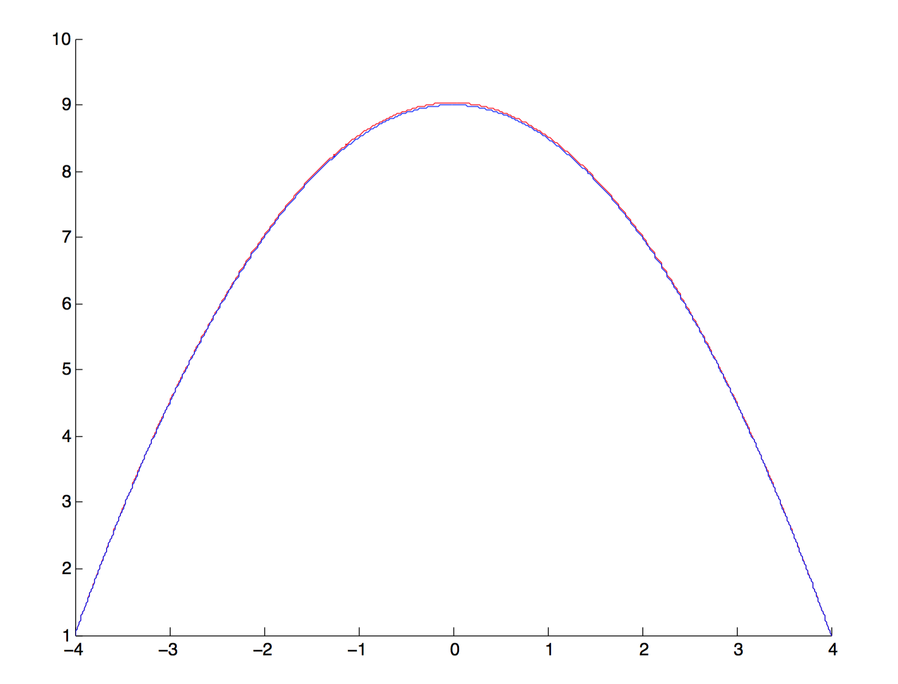

[mathjax]

# Problem1
## 1. 推导A矩阵
设$u(x)$的定义域是$[a,b]$，将这个区域等分成很多个小区间$[x_1, x_2], [x_2, x_3],..., [x_{n-1}, x_n]$。在每个区间中，有：
$$ \frac{\partial ^2}{\partial x^2} u_i=\frac{1}{\Delta x}(\frac{u_{i+1}-u_i}{\Delta x}-\frac{u_i-u_{i-1}}{\Delta x})=\frac{1}{\Delta x^2}(u_{i-1}-2u_i + u_{i+1}) \\\\ i = 2, 3, ..., n-2, n-1 $$
因此，可以将方程写为：
$$\frac{\partial u}{\partial t} = \frac{\partial ^2}{\partial x^2} u = \frac{1}{\Delta x^2}\begin{bmatrix}
-2 &amp; 1 \\\\
1 &amp; -2 &amp; 1 \\\\
&amp; \ddots &amp; \ddots &amp; \ddots \\\\
&amp; &amp; 1 &amp; -2 &amp; 1 \\\\
&amp; &amp; &amp; &amp; 1 &amp; -2 \end{bmatrix}\begin{bmatrix}
u_2 \\\\ u_3 \\\\ \vdots \\\\ u_{n-2} \\\\ u_{n-1} \end{bmatrix} + \frac{1}{\Delta x^2}\begin{bmatrix}
u_1 \\\\ 0 \\\\ \vdots \\\\ 0 \\\\ u_n \end{bmatrix}= Au + B
$$

## 2. 时间坐标上的迭代
### 1) Forward Explicit
使用$t$时刻的$Au$作为温度的导数，有
$$
\frac{\partial u}{\partial t} = \frac{u_{t+1}-u_t}{\Delta t} = Au_t +B\\\\
u_{t+1} = u_t + \Delta t (A u_t+B)
$$

### 2) Backward Explicit
使用$t+1$时刻的$Au$作为温度的导数，有
$$
\frac{\partial u}{\partial t} = \frac{u_{t+1}-u_t}{\Delta t} = Au_{t+1} +B\\\\
u_{t+1} = (I-\Delta t A)^{-1}(u_t+\Delta tB)
$$

### 3) Crank-Nicolson
仿照Backward Explicit的做法，可以得到：
$$u^{t+1} = (2I-\Delta t A)^{-1}((2I+\Delta t A)u^t+2\Delta t B)$$
# Problem 2
## 1.
含时的薛定谔方程写作：
$$
i\hbar \frac{\partial \psi(x,t)}{\partial t}=-\frac{\hbar^2}{2m}\frac{\partial^2\psi(x,t)}{\partial x^2}+V(x)\psi(x,t)
$$
同时除以体系的能量$E_0$，并取长度的量纲为1：
$$
i \frac{\partial \psi(x,t)}{\partial \mu} = -\frac{1}{\gamma^2}\frac{\partial^2\psi(x,t)}{\partial x^2}+v(x)\psi(x,t)
$$
其中，$\mu=\frac{t}{\tau}, \tau=\frac{\hbar}{E_0}$，$\gamma^2=\frac{2mE_0}{\hbar^2}$，$v(x)=\frac{V(x)}{E_0}$

选取单位制，调整质量的量纲，使得$\frac{2mE_0}{\hbar^2}=1$，又得到$\gamma^2=1$。并将以$x,t$为变量的$\psi$函数写成以$\mu, x$为变量的形式，最终方程可以写成：
$$
i \frac{\partial \psi(x, \mu)}{\partial \mu}=-\frac{\partial^2\psi(x, \mu)}{\partial x^2}+v(x)\psi(x, \mu)
$$

## 2.
设$\psi(x)$的定义域是$[a,b]$，将这个区域等分成很多个小区间$[x_1, x_2], [x_2, x_3],..., [x_{n-1}, x_n]$。用与上题完全相同的过程，得到：
$$
\psi^{t+1} = (\beta I - A)^{-1}((\beta I+A) \psi^t + 2 B)
$$
其中，
$$
\beta = \frac{2i}{\Delta \mu} \\\\
A = -\frac{1}{ \Delta x^2}\begin{bmatrix}
-2 -  \Delta x^2 v_2(x) &amp; 1 \\\\
1 &amp; -2 -  \Delta x^2 v_3(x) &amp; 1 \\\\
&amp; \ddots &amp; \ddots &amp; \ddots \\\\
&amp; &amp; 1 &amp; -2 -  \Delta x^2 v_{n-2}(x) &amp; 1 \\\\
&amp; &amp; &amp; 1 &amp; -2 -  \Delta x^2 v_{n-1}(x) \\\\ \end{bmatrix} \\\\
B = \begin{bmatrix}
\psi_1 \\\\ 0 \\\\ \vdots \\\\ 0 \\\\ \psi_n \end{bmatrix}
$$

# Problem 3
设$f(x)=x$，则根据center difference formula, 
$$
\frac{\delta f}{\delta x} = \frac{(x+\frac{1}{2}h)-(x-\frac{1}{2}h)}{h} = 1 = \frac{df}{dx} 
$$
同理，设$f(x)=x^2$，
$$
\frac{\delta f}{\delta x} = \frac{(x+\frac{1}{2}h)^2 - (x-\frac{1}{2}h)^2}{h} = \frac{2xh}{h} = 2x = \frac{df}{dx}
$$
得证。

# Problem 4
## 1.
$$\int \frac{d^2 u}{dx^2}dx=\int -1dx \\\\
\int d(\frac{du}{dx}) = -x + C \\\\
u'(x) = -x + C_1 \\\\
u(x) = -\frac{1}{2}x^2 + C_1 x + C_2$$
假定我们的边界是$[a,b]$，根据题目要求，在边界上函数值为1，代入边界条件：
$$
u(a) = \frac{1}{2}a^2 + C_1 a + C_2 = 1 \\\\
u(b) = \frac{1}{2}b^2 + C_1 b + C_2 = 1
$$
得到：
$$
u(x) = 1-\frac{ab}{2} + \frac{(a+b)x}{2}-\frac{x^2}{2}
$$
## 2.
上面已经多次遇到A矩阵，直接写出：
$$
\begin{bmatrix}
-2 &amp; 1 \\\\
1 &amp; -2 &amp; 1 \\\\
&amp; 1 &amp; -2 &amp; 1 \\\\
&amp; &amp; \ddots &amp; \ddots &amp; \ddots \\\\
&amp; &amp; &amp; 1 &amp; -2\end{bmatrix}\begin{bmatrix}
u_2 \\\\ u_3 \\\\ \vdots \\\\ u_{n-2} \\\\ u_{n-1} \end{bmatrix} = (\frac{b-a}{n-1})^2\begin{bmatrix}
-1-(\frac{b-a}{n-1})^{-2} \\\\ -1 \\\\ \vdots \\\\ -1 \\\\ -1-(\frac{b-a}{n-1})^{-2}\end{bmatrix}$$
取两端点为-4, 4，分割为1000个区间。MATLAB代码求解方程如下：
<pre class="lang:matlab decode:true crayon-selected">B = repmat([1 -2 1], 999, 1);
A = spdiags(B, [1, 0, -1], 999,999);
b = repmat([-8*8/998/998], 999, 1);
b(1,1) = b(1,1)-1;
b(999,1) = b(999,1)-1;
y = (inv(A) * b)';
y = [1 y 1];
x = [-4:0.008:4];
yy = 9-x.^2/2;
figure;
clf;
hold on;
plot(x, y, 'r');
plot(x, yy, 'b');</pre>
## 3. 直接将结果输入MATLAB进行绘图：

结果还是很精确的。