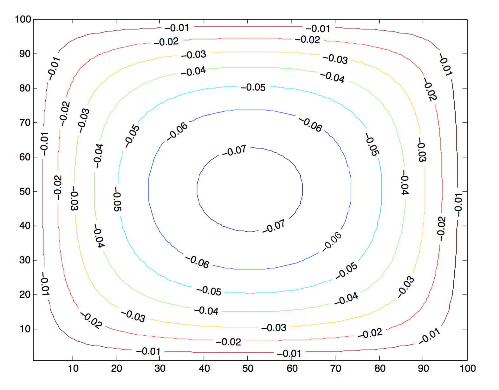
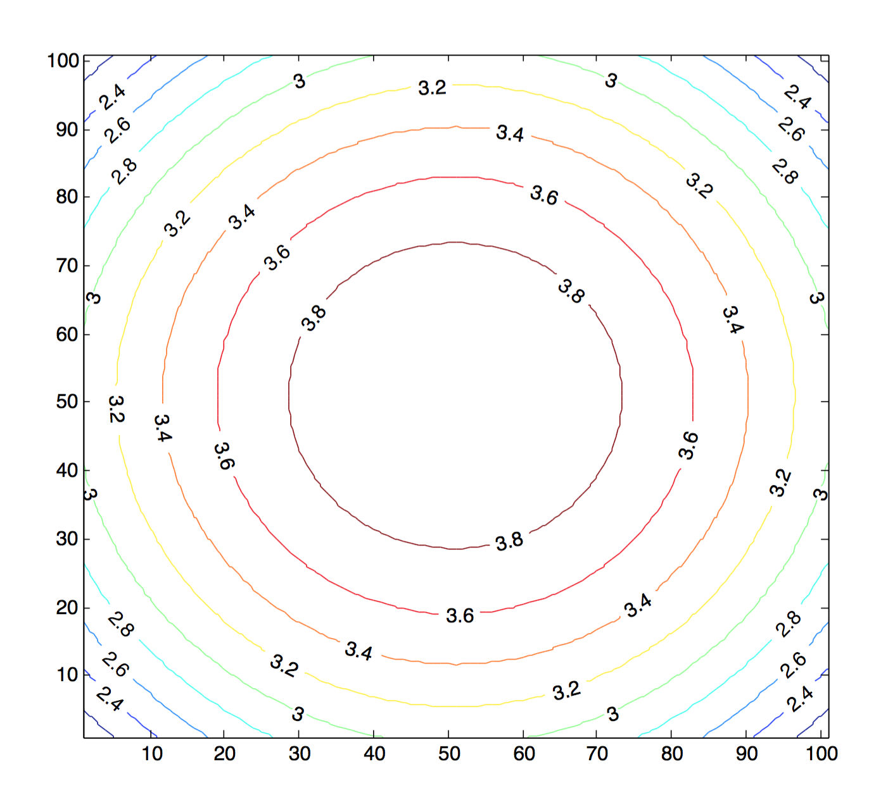
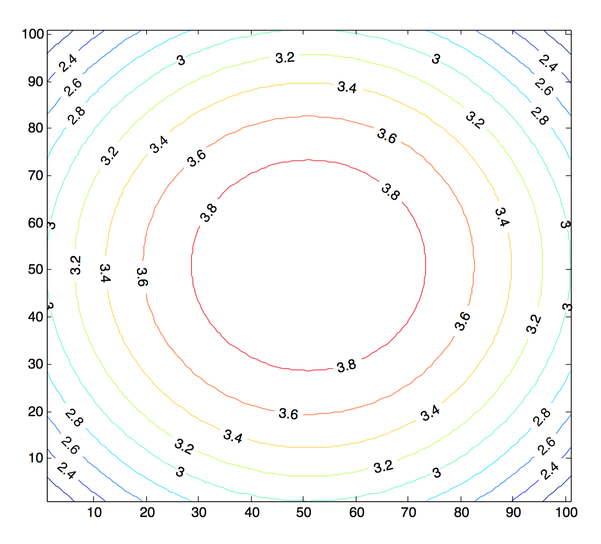

[mathjax]

## 矩阵的推导
将X轴等分成$N_x+1$段，两端点边界条件已知，中间有$N_x$个未知的点；将Y轴等分成$N_y+1$段，两端点边界条件已知，中间有$N_y$个未知的点，$N_x=N_y$。于是，在任意区域内一点上，可以写出拉普拉斯算符：
$$
\nabla^2 u_{x,y}=\frac{1}{\Delta x^2}(u_{x-1,y}+u_{x+1,y}-2u_{x,y})+\frac{1}{\Delta y^2}(u_{x,y-1}+u_{x,y+1}-2u_{x,y})
$$
将$u_{x,y}$写成列向量：
$$
\mathbf{u}=\begin{bmatrix}
u_{1,1} &amp; u_{2,1} &amp; \dots &amp; u_{N_x,1} &amp; u_{1,2} &amp; \dots &amp; u_{N_x, N_y}
\end{bmatrix}^T
=\begin{bmatrix}
u_{x,1} &amp; u_{x,2} &amp; \dots &amp; u_{x,N_y}
\end{bmatrix}^T
$$
因此，可以推导出：
$$
\nabla^2 u_{x,y}=\begin{bmatrix}
\frac{1}{\Delta x^2}\mathbf{A} \\\\
&amp; \frac{1}{\Delta x^2}\mathbf{A} \\\\
&amp; &amp; \ddots \\\\
&amp; &amp; &amp; \frac{1}{\Delta x^2}\mathbf{A}
\end{bmatrix}\begin{bmatrix}
u_{x,1} \\\\ u_{x,2} \\\\ \vdots \\\\ u_{x,N_y}
\end{bmatrix} + \frac{1}{\Delta x^2} \begin{bmatrix}
\mathbf{\alpha_{x,1}} \\\\ \mathbf{\alpha_{x,2}} \\\\ \vdots \\\\ \mathbf{\alpha_{x,N_y}}
\end{bmatrix} \\\\
+ \frac{1}{\Delta y^2}(u_{x,y-1}+u_{x,y+1}-2u_{x,y})
$$

其中，
$$
\mathbf{A} = \begin{bmatrix}
-2 &amp; 1 \\\\
1 &amp; -2 &amp; 1 \\\\
&amp; \ddots &amp; \ddots &amp; \ddots \\\\
&amp; &amp; 1 &amp; -2
\end{bmatrix} \\\\
\mathbf{\alpha_{x,y}} = \begin{bmatrix}
u_{0,y} \\\\ 0 \\\\ \vdots \\\\ u_{N_x+1,y}
\end{bmatrix}
$$
继续将余下的项放入矩阵中，并将微分方程右端的$f$也和$u$一样做同样的处理，得到：
$$
\nabla^2 u_{x,y}=\begin{bmatrix}
\frac{1}{\Delta x^2}\mathbf{A}-\frac{2}{\Delta y^2}\mathbf{I} &amp; \frac{1}{\Delta y^2}\mathbf{I} \\\\
\frac{1}{\Delta y^2}\mathbf{I} &amp; \frac{1}{\Delta x^2}\mathbf{A}-\frac{2}{\Delta y^2}\mathbf{I} &amp; \frac{1}{\Delta y^2}\mathbf{I} \\\\
&amp; \ddots &amp; \ddots &amp; \ddots \\\\
&amp; &amp; \frac{1}{\Delta y^2}\mathbf{I} &amp; \frac{1}{\Delta x^2}\mathbf{A}-\frac{2}{\Delta y^2}\mathbf{I}
\end{bmatrix}\begin{bmatrix}
u_{x,1} \\\\ u_{x,2} \\\\ \vdots \\\\ u_{x,N_y}
\end{bmatrix} \\\\ + \frac{1}{\Delta x^2}\begin{bmatrix}
\mathbf{\alpha_{x,1}} \\\\ \mathbf{\alpha_{x,2}} \\\\ \vdots \\\\ \mathbf{\alpha_{x,N_y}}
\end{bmatrix} + \frac{1}{\Delta y^2}\begin{bmatrix}
\mathbf{u_{x,0}} \\\\ \mathbf{0} \\\\ \vdots \\\\ \mathbf{u_{x,N_y+1}}
\end{bmatrix}= \begin{bmatrix}
f_{x,1} \\\\ f_{x,2} \\\\ \vdots \\\\ f_{x,N_y}
\end{bmatrix}
$$

## 编写代码实现上述算法
使用MATLAB撰写函数：
<pre class="wrap:true lang:matlab decode:true">function u = poisson(boundary, f, N, width, height)
% f: N * N array
% boundary: cell of size 4: bottom, top, left, right

% check parameters:
if ~iscell(boundary) || ~(size(boundary, 1) == 4)
    error 'boundary should be a 1x4 cell.';
end
for i = 1:4
    if ~ismatrix(boundary{i}) || ...
       ~(ndims(boundary{i}) == 2) || ...
       ~(size(boundary{i}, 1) == 1) || ...
       ~(size(boundary{i}, 2) == N)
        error 'boundary should contain four 1xN matrix.';
    end
end
if ~(ndims(f) == 2) || ... 
   ~(size(f, 1) == N) || ...
   ~(size(f, 2) == N)
   error 'f should be a NxN matrix.';
end
if width &lt;= 0
    error 'width should &gt; 0.';
end
if height &lt;= 0
    error 'height should &gt; 0.';
end

N2 = N*N;
DX = width / (N + 1);
DY = height / (N + 1);

f = reshape(transpose(f), [N2,1]);

boundary_b = transpose(boundary{1});
boundary_t = transpose(boundary{2});
boundary_l = transpose(boundary{3});
boundary_r = transpose(boundary{4});

f(1:N) = f(1:N) - boundary_b ./ (DY*DY);
f(N2-N+1:N2) = f(N2-N+1:N2) - boundary_t ./ (DY*DY);
for i = 1:N
    offset = (i-1) * N;
    f(offset+1) = f(offset+1) - boundary_l(i) / (DX*DX);
    f(offset+N) = f(offset+N) - boundary_r(i) / (DX*DX);
end

% a: small A
a = repmat([1, -2, 1], N);
a = spdiags(a, [1,0,-1], N,N) ./ (DX*DX);

i = eye(N) ./ (DY*DY);

A = kron(eye(N), a-i.*2);
for j = 1:N-1
    x = j*N+1;
    y = (j-1)*N+1;
    A(x:x+N-1,y:y+N-1) = i;
    A(y:y+N-1,x:x+N-1) = i;
end

u = A \ f;
u = transpose(reshape(u, [N,N]));
end</pre>

## 计算、绘图
求解区间为$0<x<1, 0<y<1$，并取$N=100$，所有的边界条件均为0，$f=1$，代码如下：
 
<pre class="lang:default decode:true " >boundary=cell(4);
for i=1:4
    boundary{i}=zeros(1,100);
end
f = ones(100);
contour(poisson(boundary, f, 100, 1, 1), 'ShowText','on');</pre> 

## 解析解的验证
令$f=-4$，并首先设圆形的边界$u(x^2+y^2=4)=0$，它的解是：
$$
u(x,y) = 4-x^2-y^2
$$
然后取$x^2+y^2\le 4$的一个子集：$-1<x<1, -1<y<1$。并取$N=101$，边界条件为：
$$
u(x,y) = 4-x^2-y^2
$$
数值解出即可代回验证程序正确性。求解的代码如下：
 
<pre class="wrap:true lang:default decode:true " >boundary=cell(4);
b = zeros(1,101);
for i=1:101
    b(i) = 4-1-((i-51)/50)^2;
end
for i=1:4
    boundary{i}=b;
end
f = ones(101) * -4;
contour(poisson(boundary, f, 101, 2, 2), 'ShowText','on');</pre> 

还可以编写代码，求出解析解：
 
<pre class="lang:default decode:true " >u = zeros(101);

for i=1:101
    for j=1:101
        x = (i-51)/50;
        y = (j-51)/50;

        u(i,j) = 4-x^2-y^2;
    end
end

contour(u, 'ShowText','on');</pre> 

可见这里的代码解出的数值解是符合解析解的。