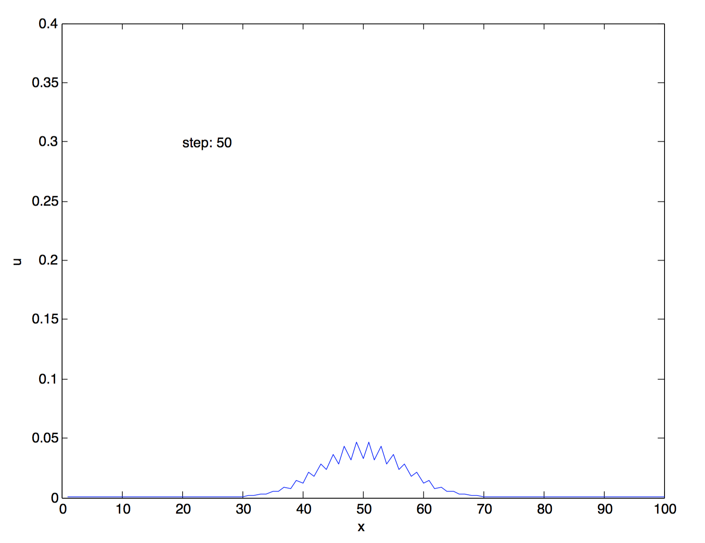
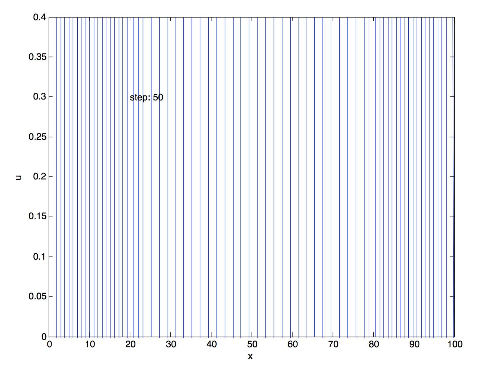
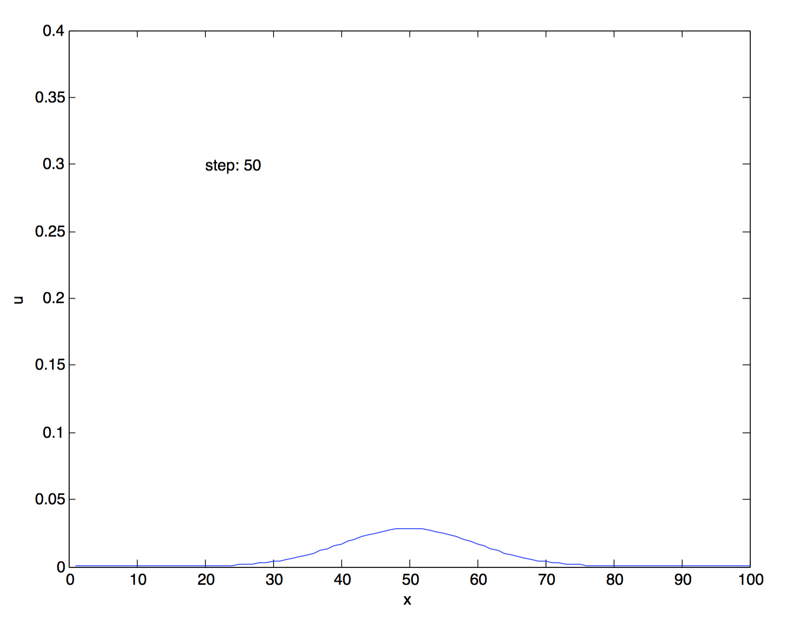
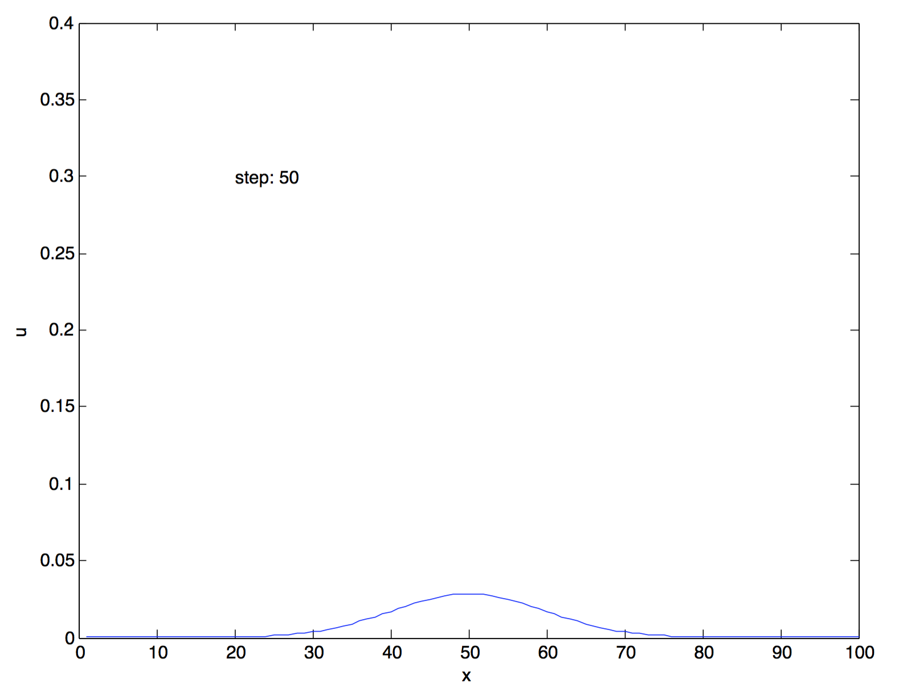
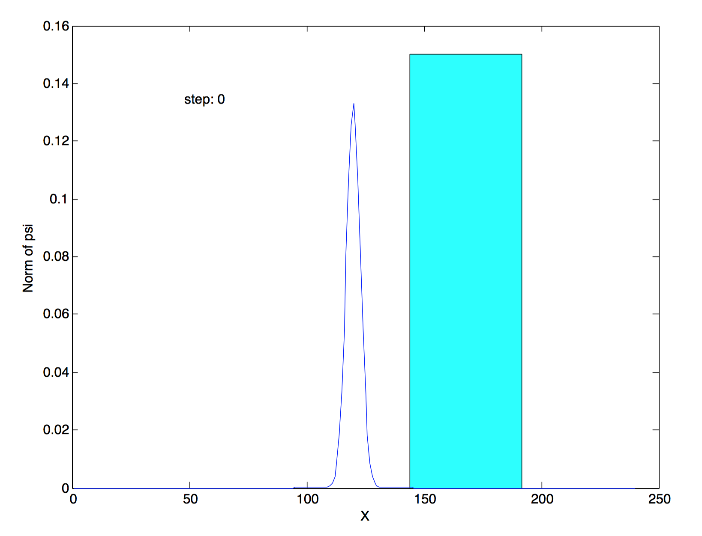
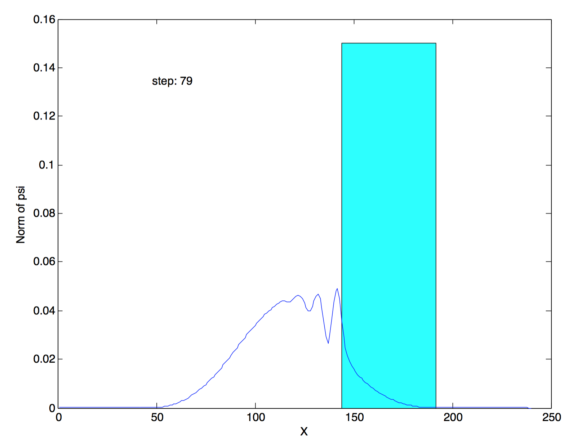
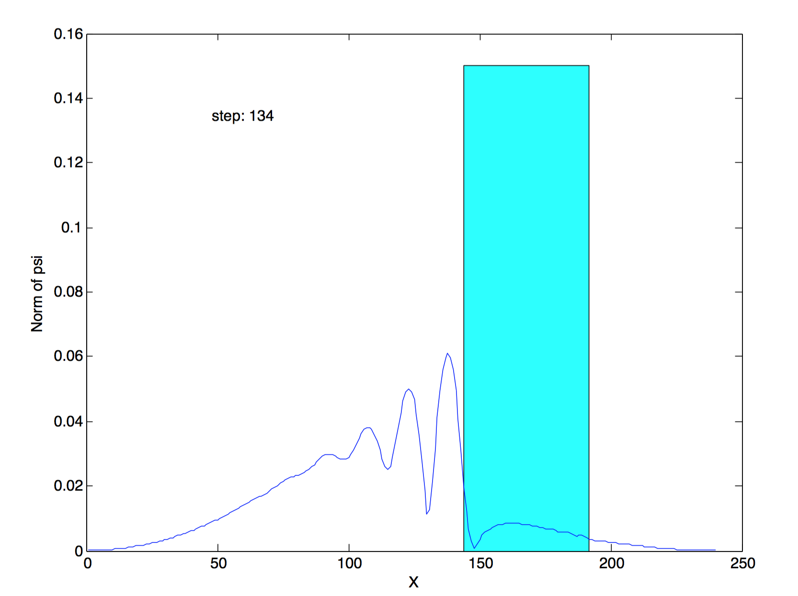

[mathjax]

# 1. Heat equation
一维的热方程是：

$$
\frac{\partial u}{\partial t} = \frac{\partial^2 u}{\partial t^2}
$$
我们这里使用第一类边界条件，并设边界上温度为零，回想起之前作业一中推导的热传导方程矩阵解法的递推公式：
Forward Explicit：
$$
u_{t+1} = u_t + \Delta t (A u_t+B)
$$
Backward implicit:
$$
u_{t+1} = (I-\Delta t A)^{-1}(u_t+\Delta tB)
$$
Crank-Nicolson:
$$
u_{t+1} = (2I-\Delta t A)^{-1}((2I+\Delta t A)u_t+2\Delta t B)
$$
其中，
$$
A=\frac{1}{\Delta x^2}\begin{bmatrix}
-2 &amp; 1 \\\\
1 &amp; -2 &amp; 1 \\\\
&amp; \ddots &amp; \ddots &amp; \ddots \\\\
&amp; &amp; 1 &amp; -2 &amp; 1 \\\\
&amp; &amp; &amp; &amp; 1 &amp; -2 \end{bmatrix}
$$
由于选取了零的边界条件，故向量$B$是零向量。

### 首先使用Forward Explicit方法求解热传导方程：
<pre class="wrap:true lang:matlab decode:true">function heat_equation()
  dx = 1;
  k = 0.5;
  dt = k * dx^2;
  N = 100;

  A = spdiags(repmat([1 -2 1], N, 1), [1 0 -1], N, N) / dx^2;

  x = transpose([1:dx:dx*N]);
  u = exp(-(x-N*dx/2).^2)/sqrt(2*pi);
  b = zeros(N,1);

  for j=1:100
    plot(x,u);
    axis([0 N 0 0.4]);
    text(0.2*N, 0.3, sprintf('step: %d', j));
    ylabel('u');
    xlabel('x');
                                % forward explicit
    u = (eye(N)+dt*A)*u + dt*b;

    pause(0.05);
  end
end
</pre>
上面使用了$k=0.5$，程序运行的示例如下：

求解效果不是很理想，解很不光滑。将$k$改成更大的值，例如$k=1.0$：

现在解完全不收敛了。

### 然后使用Backward implicit解法求解：
<pre class="wrap:true lang:matlab decode:true">function heat_equation()
  dx = 1;
  k = 1.0;
  dt = k * dx^2;
  N = 100;

  A = spdiags(repmat([1 -2 1], N, 1), [1 0 -1], N, N) / dx^2;

  x = transpose([1:dx:dx*N]);
  u = exp(-(x-N*dx/2).^2)/sqrt(2*pi);
  b = zeros(N,1);

  for j=1:100
    plot(x,u);
    axis([0 N 0 0.4]);
    text(0.2*N, 0.3, sprintf('step: %d', j));
    ylabel('u');
    xlabel('x');
                                % backward implicit
    u = inv(eye(N)-dt*A)*(u+dt*b);

    pause(0.05);
  end
end
</pre>

解的性质好了很多－－至少要比Forward Explicit光滑很多。

### 最后，使用Crank-Nicolson：
<pre class="wrap:true lang:matlab decode:true">function heat_equation()
  dx = 1;
  k = 1.0;
  dt = k * dx^2;
  N = 100;

  A = spdiags(repmat([1 -2 1], N, 1), [1 0 -1], N, N) / dx^2;

  x = transpose([1:dx:dx*N]);
  u = exp(-(x-N*dx/2).^2)/sqrt(2*pi);
  b = zeros(N,1);

  for j=1:100
    plot(x,u);
    axis([0 N 0 0.4]);
    text(0.2*N, 0.3, sprintf('step: %d', j));
    ylabel('u');
    xlabel('x');
                                % crank-nicolson
    u = inv(2*eye(N) - dt*A) * ((2*eye(N) + dt*A)*u + 2*dt*b);

    pause(0.05);
  end
end
</pre>

同样，解的性质也要比Forward explicit好很多。

总之，可以从三种Time Scheme发现，解的性质和求解的复杂度以及计算量是矛盾的，要想提高解的性质，就必须使用更复杂的方法，使用更多的CPU时长。在对解的性质要求不高的地方，使用Backward implicit比较好，如果要精确的话，就需要用更复杂的Crank-Nicolson。另外，对求解公式中的参数选取很重要，$\Delta x,\Delta t,k$的选择直接影响了求解速度（过小的时间步长虽然精确，但会使求解过于缓慢），和求解精度（$k$选择不当会让解发散），所以应该进一步从理论上、经验上找到合适的变量缩放比率，求解参数。

# 2. Schrodinger equation
无量纲化的薛定谔方程是：
$$
i \frac{\partial \psi(x, t)}{\partial t}=-\frac{\partial^2\psi(x, t)}{\partial x^2}+v(x)\psi(x, t)
$$
之前已经推导出薛定谔方程的矩阵解法：
$$
\psi_{t+1} = (\beta I - A)^{-1}((\beta I+A) \psi_t + 2 B) \\\\
\beta = \frac{2i}{\Delta t} \\\\
A = -\frac{1}{ \Delta x^2}\begin{bmatrix}
-2 - \Delta x^2 v_2(x) &amp; 1 \\\\
1 &amp; -2 - \Delta x^2 v_3(x) &amp; 1 \\\\
&amp; \ddots &amp; \ddots &amp; \ddots \\\\
&amp; &amp; 1 &amp; -2 - \Delta x^2 v_{n-2}(x) &amp; 1 \\\\
&amp; &amp; &amp; 1 &amp; -2 - \Delta x^2 v_{n-1}(x) \\\\ \end{bmatrix} \\\\
B = \begin{bmatrix}
\psi_1 \\\\ 0 \\\\ \vdots \\\\ 0 \\\\ \psi_n \end{bmatrix}
$$
这个问题中讨论高斯波包的演化必须使用无穷的求解区间。但实际上在一定时间内，高斯波包的传播范围是有限的，因此可以在这段时间中使用第一类边界条件，并取边界上波函数为$0$。也就是说$B$是零向量。另外再取$\Delta t=k\Delta x^2$，就可以得到新的求解方程：
$$
\psi_{t+1} = (\beta I - A)^{-1}((\beta I+A) \psi_t) \\\\
\beta = \frac{2i}{k\Delta x^2}
$$
初始条件取为$\mu=\frac{1}{2}N\Delta x, \sigma=3\Delta x$，取势垒的位置为$[\frac{3}{5},\frac{4}{5}]N\Delta x$，将这些条件全部应用之后，求解的程序如下：
<pre class="wrap:true lang:matlab decode:true">function schrodinger()
                              % set up parameters
  k = 0.5;
  V = 0.2;
  dx = 1;
  N = 240;

  xrange = transpose([1:dx:dx*N]);

                                % initial condition: sigma=3dx, mu=0.5Ndx
  sigma = 3 * dx;
  psi = exp(-(xrange-0.5*N*dx).^2/2/sigma^2)/sqrt(2*pi*sigma^2);

                                % setup A and B
  A = spdiags(repmat([-1 2 -1], N, 1), [1 0 -1], N, N) / dx^2;
                                % V is in between 0.6N to 0.8N
  for j=N/5*3:N/5*4
    A(j,j)=A(j,j)+V;
  end

  B = zeros(N,1);

  beta = 2*i/k/dx^2;

                                % axis([0 250 0 0.15]);
  j=0;
  while 1
    psi_normal = abs(psi);

    fill([N/5*3 N/5*3 N/5*4 N/5*4], [0 0.15 0.15 0], 'c');

    hold on;
    plot(xrange, psi_normal);
    hold off;

    text(N*0.2, 0.15*0.9, sprintf('step: %d', j));
    xlabel('X');
    ylabel('Norm of psi');

    psi = inv(beta*eye(N)-A)*((beta*eye(N)+A)*psi+2*B);
    pause(0.01);

    if abs(psi(1,1))&gt;0.0001 || abs(psi(N,1))&gt;0.0001
      break;
    end

    j = j+1;
  end

end
</pre>
程序每次迭代出波函数之后，就会求出它的模方绘制图像，同时势垒的位置用蓝色的方框表示。迭代的终止条件是波函数的演化范围达到边界，此时求解范围就已经不合适了。

$t=0$的波函数模方：

波包进入势垒初期的波函数模方：

波包穿过势垒，到达求解边界上，程序终止：

使用无量纲化的薛定谔方程求解波包传播问题，有一些需要注意的事项：首先就是波包位置的选取，如果波包初始位置距离势垒太远，那么波函数扩展到边界的时候，很可能还没有穿过势垒，程序过早停止不利于观察波包的势垒透射过程；其次，$\Delta x,\Delta t$的选择非常关键，如果大小不合适，$\Delta t$过大，会导致课堂上说的发散，但若$\Delta t$过小，计算过程就会非常慢，造成计算资源的浪费。